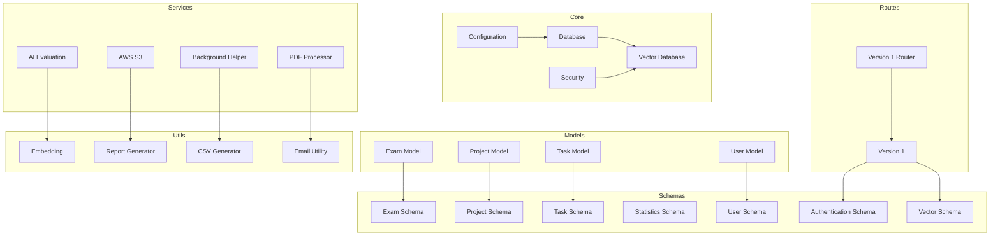

```mermaid
graph TD
    subgraph Core
        config["Configuration"]
        database["Database"]
        security["Security"]
        vectordb["Vector Database"]
    end

    subgraph Models
        exam_model["Exam Model"]
        project_model["Project Model"]
        task_model["Task Model"]
        user_model["User Model"]
    end

    subgraph Routes
        v1_router["Version 1 Router"]
        v1["Version 1"]
    end

    subgraph Schemas
        auth_schema["Authentication Schema"]
        exam_schema["Exam Schema"]
        project_schema["Project Schema"]
        stat_schema["Statistics Schema"]
        task_schema["Task Schema"]
        user_schema["User Schema"]
        vector_schema["Vector Schema"]
    end

    subgraph Services
        ai_evaluation["AI Evaluation"]
        aws_s3["AWS S3"]
        background_helper["Background Helper"]
        pdf_processor["PDF Processor"]
    end

    subgraph Utils
        csv_generator["CSV Generator"]
        email_util["Email Utility"]
        embedding["Embedding"]
        report_generator["Report Generator"]
    end

    config --> database
    database --> vectordb
    security --> vectordb

    exam_model --> exam_schema
    project_model --> project_schema
    task_model --> task_schema
    user_model --> user_schema

    v1_router --> v1
    v1 --> auth_schema
    v1 --> vector_schema

    ai_evaluation --> embedding
    aws_s3 --> report_generator
    background_helper --> csv_generator
    pdf_processor --> email_util
```
